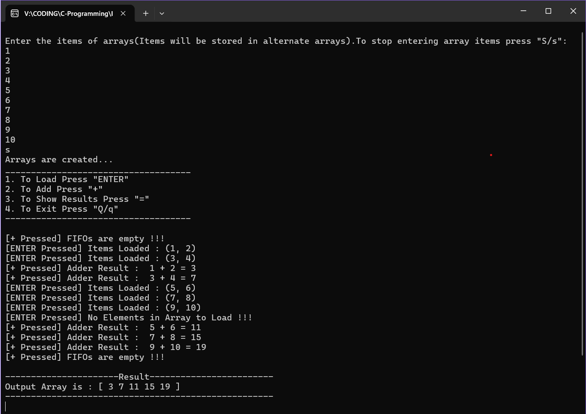

# Assignment - Submitted by Adarsh Dash

#### Create an adder that can take input from 2 integer arrays, one at a time in a loop and output into a 3rd array. 
#### Introduce 2 fifos that store the inputs from the array with every press of "enter key", an add signal that pops the first entry and adds them on pressing the "+ key"

## Working Structure
1. Taking input for two dynamic integer arrays.
2. Loading array elements into two separate FIFO queues.
3. Performing addition of the front elements from both FIFOs when the "+" key is pressed.
4. Storing the result in a third output array.
5. Displaying the final output array when the program exits.
   
## Approach
1. ```addArrayItems(arrA,arrB)```: A function  that adds elements into 2 arrays arrayA and arrayB one after another until a keystroke "s" is obtained.

2. ```loadToFifos(arrA,arrB,qA,qB,index)```: A function that loads the array element pair (each from both arrays) to 2 Fifos qA and qB using array index.

3. ```adder(qA,qB,results)```: A function that pops the front elements from the Fifos and add them together with storing the result in results array.

4. ```displayResults(results)```: A function that prints all the elements of the result array.


### Key-driven operations:

```ENTER``` : Load next pair of elements into FIFOs.

```+``` : Pop and add front elements from FIFOs.

```ESC``` : Exit program.

### How to Compile and Run
Compile using:
```
g++ intelAssignment.cpp -o intelAssignment
```

Run using:
```
./intelAssignment
```

## Program Output



